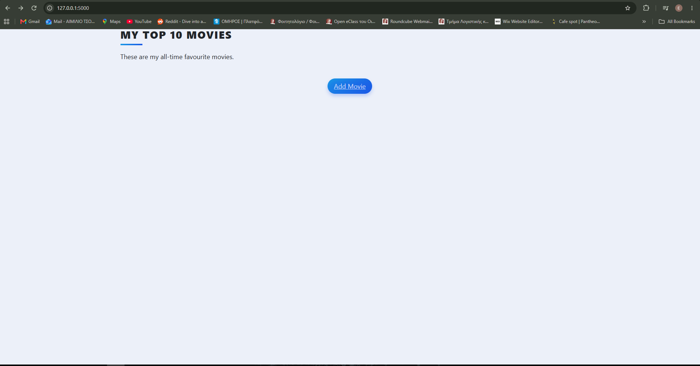
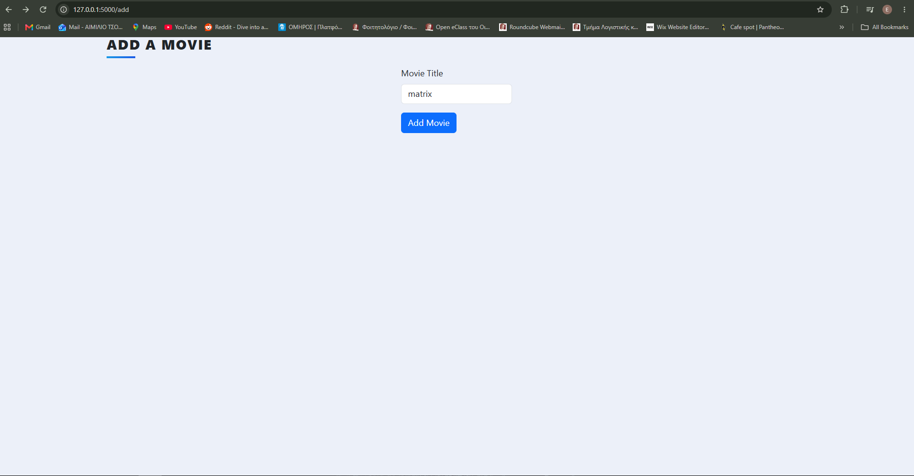
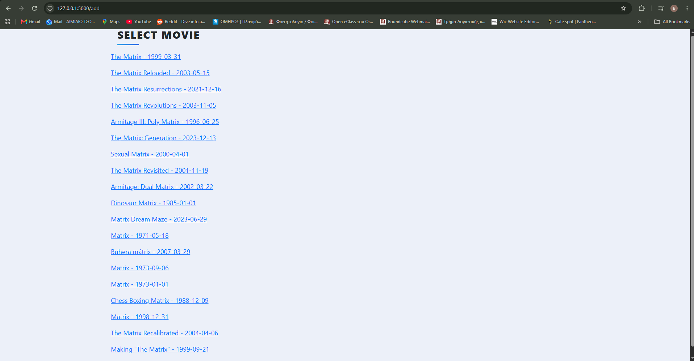
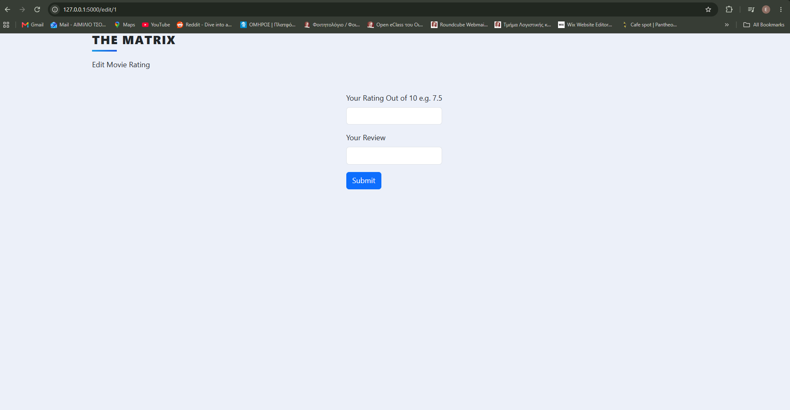
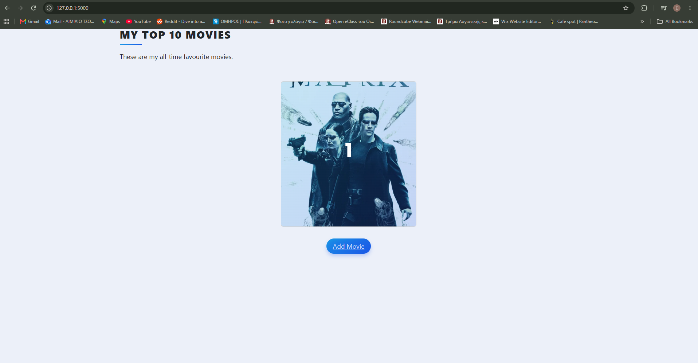
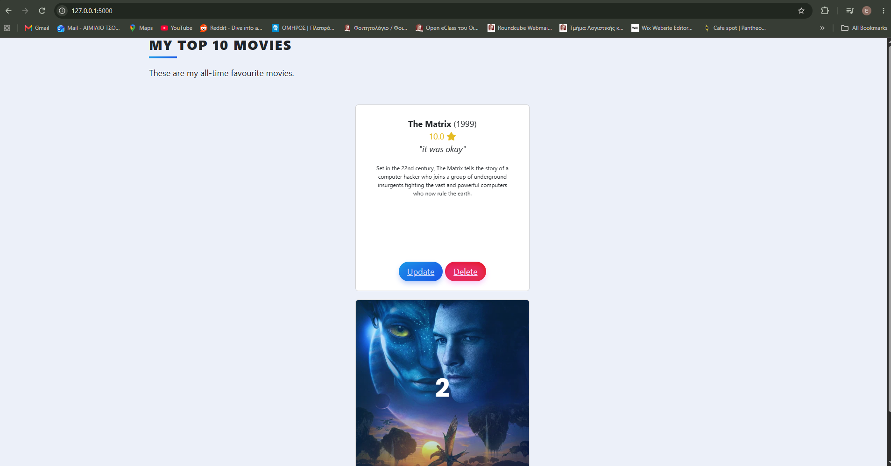

Top Movies

A Flask-based web application for creating and managing a personal list of top movies. Users can search for movies using the TMDB API, add them to their collection, rate and review them, and manage their rankings.

Features:

Search for movies using the TMDB API
Add movies to your personal movie list
Rate movies out of 10
Add personal reviews
Automatically rank movies based on their ratings
Delete movies from the list
Store movie data using a local SQLite database
Store API credentials securely using environment variables
Responsive interface using Bootstrap

Technologies:

Python
Flask
Flask-SQLAlchemy
SQLAlchemy
SQLite
Flask-WTF / WTForms
Bootstrap 5
TMDB API
python-dotenv
HTML / Jinja2

Screenshots: 
1.Homepage

2.Search Movie Title

3.Select Movie

4.Add Rating and a review

5.Homepage with Movie Poster and Info

6.More Details

